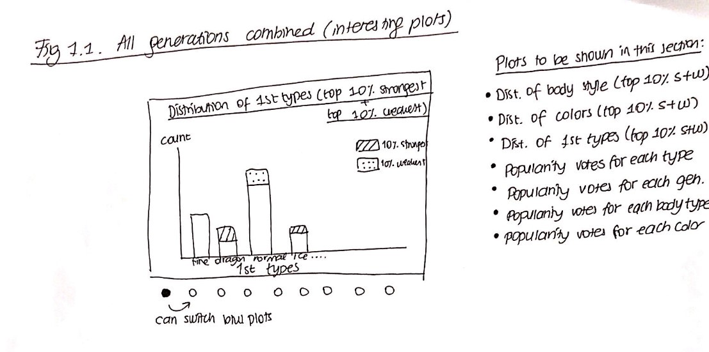
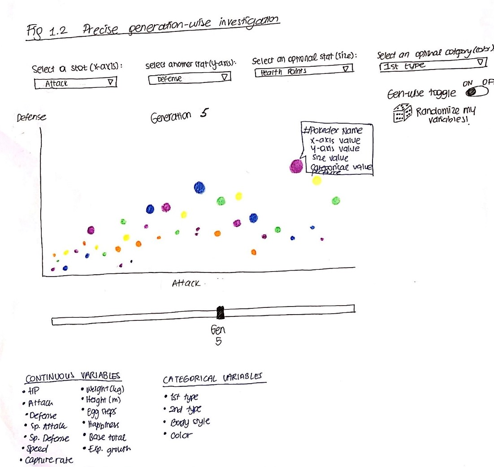

# Project of Data Visualization (COM-480)

| Student's name | SCIPER |
| -------------- | ------ |
| Ludovic Delisle| 271995 |
| Sena Necla Cetin| 314092 |
| Kamil Seghrouchni| 273938|

[Milestone 1](#milestone-1-friday-3rd-april-5pm) • [Milestone 2](#milestone-2-friday-1st-may-5pm) • [Milestone 3](#milestone-3-thursday-28th-may-5pm)

## Milestone 1 (Friday 3rd April, 5pm)

**10% of the final grade**

### Dataset

A lot of different datasets were available and it was easy to put them together thank's to the fact that pokémons all have an id that always stays the same. The main dataset is composed of 800 samples and 53 features but not all the features a complete because not all datasets went up to the last generation of the game. For each sample (pokemon) there is:
* An Id
* A name
* One or two types
* The 6 base characteristics of the pokemon (Hp, Attack, Defense, etc...)
* Measurements like height and weight
* Weaknesses
* Boolean classifier that says if it is legendary or has a mega evolution 
* Appearance features (color, body type, classification)
* Eggs information (type, steps before hatching)
* Base happiness

From other datasets, it was possible to get their ranking from strongest to weakest in battle and their ranking from most loved to least liked among the fanbase. 

* main dataset : https://www.kaggle.com/rounakbanik/pokemon
* complementary dataset : https://www.kaggle.com/alopez247/pokemon/data
* combat dataset : https://www.kaggle.com/jonathanbouchet/pokemon-battles/data
* popularity dataset : https://pastebin.com/LvhaTx7w

### Problematic

The aim of this project is to visulize pokemon's dynamics across generations for the user to better make up his own pokemon. This project also means at providing insights on the intricate links between the different pokemon features in order to gauge their  importance and impact on the pokemon overall statistics and behaviour in combat. Finally, this project will display a visulization of the choice that were made  regarding the important features throughout the generations to better understand how this game evolved with his users. 

* __Figure 1__ : Graphical representation of pokemon statistics across generations:
   
  * By default, displayed features would be the ones juged as signficantly different across generations.
  * Dynamical graphic where user could also specify the feature he is interested in.
  * Visualise feature distribution.
  * Ability to evolve through generations.
  * Provides insights on the designers choices over the generations.
* __Figure 2__ : Circular representation of feature importance and diversity in context of combat :
  * Dynamical representation of all pokemons in a circular manner. 
  * Directed graph with edges going from winners to losers. 
  * Ability to select specific generation.
  * Ability to rearrange winners and losers with respect to features such as their types, if they are legendary or not and others to be defined.
  * Ability to hover over the pokemons to  display pokemon card containing both brief textual description and spider chart of his main features. 

* __Figure 3__ : Features relationships : 
   * Aims at showing how chosing a specfic value for a feature will impact on another statistic. 
   * Dynamical bipartite graphic.
   * By default, displayed features would be the ones juged having significant relationship across generations.
   * User could chose the two features he is interested in. 
   * Dynamical vue over the generations.
* __Figure 4__: Pokemon cooking :
   * Based on previous information, recommender system will be built to help user better chose feaures and values.
   * Linking esthtic feature such as body shape and color with their outcome on other statistics.
   * Outputs the optimal pokemon choice based on a given subset of features.

### Exploratory Data Analysis

We present here a summary of our findings from our exploratory data analysis. Please refer to Milestone1.ipynb for complete findings and plots.

For the ease of collaborative work, we have separated our dataset into three logical groups. 

First, the numerical set of data was processed, displaying distributions for both all generations toguether and seperate. As preliminary observation one can mention the skewness of both height and weight variables. Most pokemons have small values for those two varibales ___Figure 1___ . Plotting the height over generations ___Figure 2___  showed that it is uniform over generations. We could  see that generation 1 and 2 had larger amount of smaller and lighter pokemons.
Boxplotting showed that weights and heights for generations 3, 4 and 5 more were spread out. 
Concerning the string variables, a investigation of the most present abilities, classifications and types was conducted and respectively shown in table ___Table 1___,___Table 4___,___Table 7___. Distributions were then ploted for the abilities ___Figure 10___ and types ___Figure 13___. A generation wise invesigation was also conducted for the distribution of abilities and types shown respectively in ___Figure 12___ and ___Figure 14___. This analysis also aimed at displaying the relationship between types and abilities ___Table 2___, abilities and classifications ___Table 5___ and classification and types ___Table 8___. Finally a further analysis aimed at displaying the rate of occurences of pairs of values for the above mentioned pairs of variables in ___Table 3___, ___Table 6___  and ___Table 9___.

Then the second group of features were processed. Our findings from this group include:

* The distributions of the continuous variables, i.e. hp, (sp_) attack, (sp_) defense, and speed are all right-skewed, meaning the medians are lower than the means. There are correlations between defense & attack, and sp_defense & sp_attack & defense & hp. The correlation (0.4) between sp_attack and sp_defense stand out with the highest value in legendary pokemon. They also have a higher correlation between sp_attack and attack. Non-legendary pokemon have a higher correlation between sp_attack and sp_defense. Generation 4 pokemon have the best median stats compared to all first 6 generations and contain the highest number and percentage of legendary pokemon. Steel-type pokemon have the least amount of damage-intake during combat. Legendary pokemon are likelier to take less damage than non-legendary. 

The third group of features contained the feature that can be concidered miscellaneous like the egg type, body type or color. Most of those features were categorical nominal variables and quite evenly distributed over the population. This group also focused on investigating the popularity among the, the power ranking and what makes a pokemon powerfull and the answer seems to be mostly linked to the pokemon type. Concerning the popularity, the key factor if the pokemon generation. Fans seem to prefer pokemons from older generations. Moreover, some types are more liked than others.

### Related Work 

There has been a lot of data analysis and visualization done on Pokemon datasets. The work includes:
*   Interactive tables where the user can sort pokemon with respect to a specific stat
*   Distributions of stats and their correlation heatmaps and scatterplots
*   Average stats for each pokemon type
*   Available moves to be learned by each (combined) type
*   Interactive comparison of two pokemon 
*   Interactive effectiveness chart of pokemon types

References to the work mentioned above:
* https://medium.com/dataregressed/data-visualization-with-tableau-pokémon-ec2a82242f8b 
*   https://medium.com/dataregressed/statistical-analysis-with-python-pokémon-1a72dd0451e1
*   https://towardsdatascience.com/exploratory-analysis-of-pokemons-using-r-8600229346fb
*   https://public.tableau.com/profile/alessandro.costanzo#!/vizhome/PokmonAGuideforBeginners_/PokmonGuide 

Our approach is original because we combine various stats available in datasets to create a holistic guide to Pokemon. We combined basic stats (e.g. speed, hp, attack), with effectiveness data (i.e. against_fire, against_bug), along with body type and egg statistics, and combats data, where we can extract which pokemon wins over which. 

1.   Statistics of variables per generation: To the best of our knowledge, previous work on this dataset does not analyze pokemon grouped by their generation. The user will be able to view the changes in stats of pokemon over generations with an interactive interface.

2.   Individual pokemon stats per generation: Even though previous work has been done on the stats of pokemon, our approach is original such that we will provide general (circular chart with pokemon, color-coded by their type) and specific (spider-charts and brief descriptions when hovered over a single pokemon) information in a single visualization.

3.   Bipartite graph of stats: Through this graph, the user will interactively get insights about the effect of each stat over the others, which hasn’t been done before.

4.   "Cook" your own pokemon: To the best of our knowledge, there has been no visualization work done on body type of pokemon. So, we decided to utilize this gap in previous work and create a recommendation system, where we recommend the user the best pokemon with their specified criteria. Even though the user may be able to find the pokemon with the best stats through simple web search, the results do not consider the user's taste in pokemon, such as their preferred color, body type, and type. 

We were inspired by the comic book visualization done in this course in the previous years. The idea of providing insight on a fun topic striked our attention. We took inspiration from their bipartite chart and their circle chart. However, our work will be different such that it will include spider charts in the visualization of specific pokemon.

Reference: https://exploringcomics.github.io/src/app/index.html 

We have not explored this topic and dataset in another context.

## Milestone 2 (Friday 1st May, 5pm)

**10% of the final grade**

The initial version of our website is accessible on [analaktycs.github.io](https://analaktycs.github.io/). 

### Figure 1.1 (extra):

#### Sketch:

#### What will be added:
An overview of the most interesting (stacked) bar plots in the dataset will be shown. The user will be able to hover over the stacks of bars on the plot to view the respective Pokemon names within that category. We may decide to only keep the popularity vote plots since they are easier to understand for the majority of users. 

#### Description of what has been done:
A sketch of the final product has been drawn to have a concrete understanding of our work for this figure. This figure is optional as we are still trying to figure out if it is interactive enough for a data visualization course and a better way to adapt it.

#### Tools to be used and inspirations from lectures: 
If we only keep the popularity votes, we will need to use the button functionality of d3.js to change input data in barplot, where we will put four buttons representing four of our variables, i.e. type, generation, body style, and color. Reference: https://www.d3-graph-gallery.com/graph/barplot_button_data_csv.html 

We will need to utilize the information from Tabular Data lecture of week 11 that explains stacked bar charts.

### Figure 1.2:

#### Sketch: 

#### What will be added:
We will create an interactive bubble plot where the user will be able to select the variables that they desire to view in the plot by choosing from their respective dropdown lists. These variables will create 6 plots that each represent Pokemon from the first 6 generations. The user will be able to switch between plots using a slider in the bottom. When the user hovers over each data point, they will be able to view the pokedex number, a picture, and the values of the variables they selected from the dropdown lists.

Extra ideas: Toggle to switch from viewing each generation individually to viewing all generations together. A button to randomize all the variables if the user wants to do some fun exploration.

#### Description of what has been done:
A skeleton of the scatterplot has been added with the dropdown links along with the generation-wise viewing toggle, and slider to select the generation. A sketch of the final product has been drawn to have a concrete understanding of our work for this figure.

#### Tools to be used and inspirations from lectures: 
d3.js bubble plot will be the main skeleton of the plot. We will then incorporate select group functionality of d3.js to account for the selected variables by the user. Colored bubble will be used to account for the categorical variable the user selects. Add tooltip will be used to allow the user to hover over a single bubble to display its stats. Reference: https://www.d3-graph-gallery.com/graph/bubble_tooltip.html 

Overall we have been inspired by the Mark Channel lecture of week 6. More specifically, we have been inspired by the “Combining marks and channels” topic, where it explains that you can utilize position, hue, and size to show your continuous variables and color to show your categorical variable. It is thus a very useful way to display four variables in a 2-D graph. We will also need the Tabular Data lecture of Week 11 for the bubble plot. 

## Milestone 3 (Thursday 28th May, 5pm)

**80% of the final grade**

